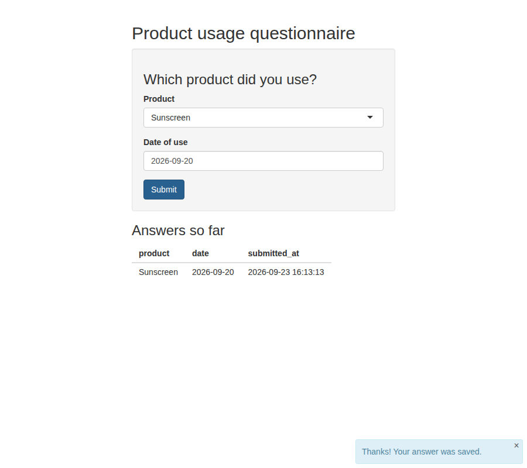

# Product usage questionnaire (Rhino app)

A very small [Rhino](https://appsilon.github.io/rhino/) app for learning.
The user picks the **product** they used (options come from `data/products.csv`)
and the **date**. Each answer is appended to `data/responses.csv` and shown in a table.



## Run it

```r
# once: install the packages
install.packages(c("rhino", "config"))

# from this folder (open questionnaire.Rproj in RStudio, or setwd() here)
shiny::runApp()
```

Change the options by editing `data/products.csv` (one product per row, under a `product` header)
and restarting the app.

## How the project is organised

```
questionnaire/
├── app.R                     # entry point, always just `rhino::app()`; don't edit
├── config.yml                # settings, read with config::get() (CSV paths live here)
├── rhino.yml                 # rhino settings (`sass: r` = build styles without Node.js)
├── data/products.csv         # the product options
├── app/
│   ├── main.R                # puts everything together (ui + server)
│   ├── logic/                # plain R, no Shiny: easy to test
│   │   ├── products.R        # read_products(): CSV -> vector of options
│   │   └── responses.R       # new_response(), save_response(), load_responses()
│   ├── view/                 # Shiny modules (pieces of UI with their server code)
│   │   ├── questionnaire.R   # the form: product dropdown, date, Submit button
│   │   └── responses_table.R # the table of answers
│   ├── styles/main.scss      # your CSS/Sass; compiled into app/static/css/app.min.css
│   └── static/               # files served to the browser as-is
└── tests/testthat/           # unit tests
```

### Key ideas to notice

1. **`box::use()` instead of `library()`.** Every file says exactly what it imports,
   e.g. `box::use(app/logic/products[read_products])`. Functions are private unless
   marked with `#' @export`.
2. **logic vs. view.** `app/logic` has no Shiny at all, so it can be tested with plain
   function calls. `app/view` holds Shiny modules.
3. **Modules talk through arguments and return values.** `questionnaire$server()` returns a
   reactive with the latest answer. `main.R` saves it and passes the list of answers
   to `responses_table$server()`.
4. **Namespaces.** Each module wraps its input ids with `ns()`, which is why the product
   input's HTML id is `app-form-product`.

## Useful rhino commands

```r
rhino::test_r()      # run the unit tests in tests/testthat
rhino::lint_r()      # check code style
rhino::build_sass()  # recompile app/styles/main.scss after you change it
```

## Note on renv

A new Rhino project usually comes from `rhino::init()`, which also sets up
[renv](https://rstudio.github.io/renv/) to pin package versions in `renv.lock`.
This project was put together without internet access to CRAN, so there's no `renv.lock` yet.
To add one, run `renv::init()` in this folder. `.renvignore` makes renv look only at
`dependencies.R`, so list any new packages there (e.g. `library(config)`).

## Ideas to practise next

- Add a free-text "Comments" field (`shiny$textAreaInput`) and save it too.
- Add a `category` column to `products.csv` and let the user filter by it first.
- Add a "Download answers" button with `shiny$downloadButton` / `shiny$downloadHandler`.
